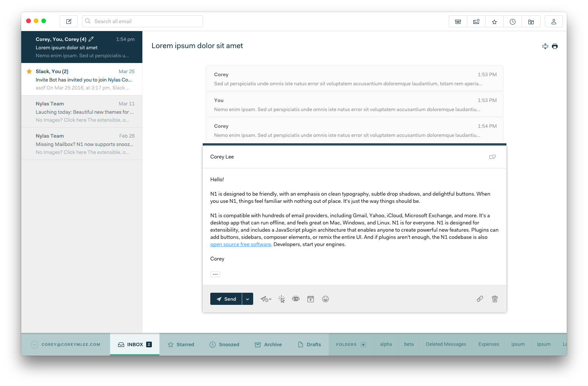

# N1 Stripe

Stripe modifies the layout of the Nylas N1 email client by moving the account sidebar to the bottom of the interface.

By moving folders to the bottom, the interface reserves the primary canvas space for messages themselves. That's the idea, anyway. This might not be for you if you regularly use many folders or if you need to toggle between separate accounts a lot.  Still, try it out and let me know what you think.

## Prototype

N1 is designed with an account sidebar in mind. Moving it to the bottom is a CSS hack, which works for the most part, but is nonetheless forcing a square peg into a round hole. Also, there are a lot of nuanced layout use cases. I addressed a bunch of them, but there were far more than I (naively) expected, so beware the thing is a "work-in-progress."

## Installation
1. Download [Nylas N1](https://nylas.com/n1).
2. Download the Stripe theme.
3. From N1, select `Nylas N1 > Install Theme...`.
4. Find the directory for this plugin to install it.
